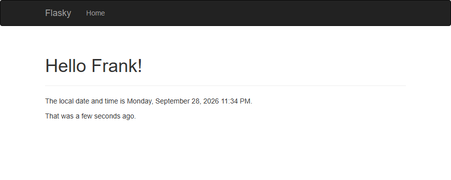
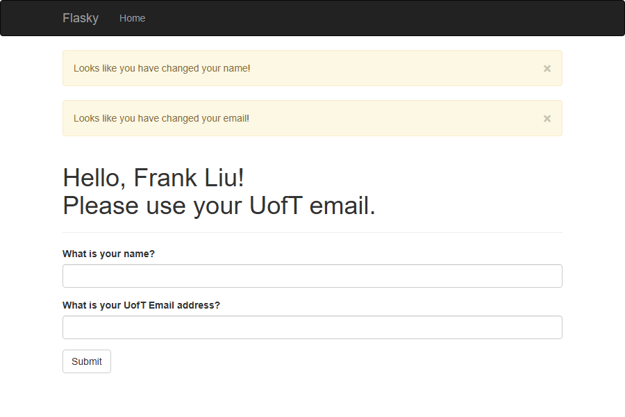
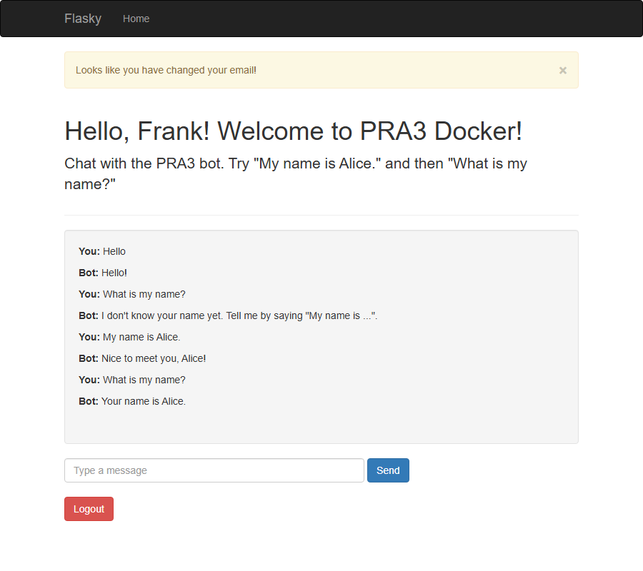
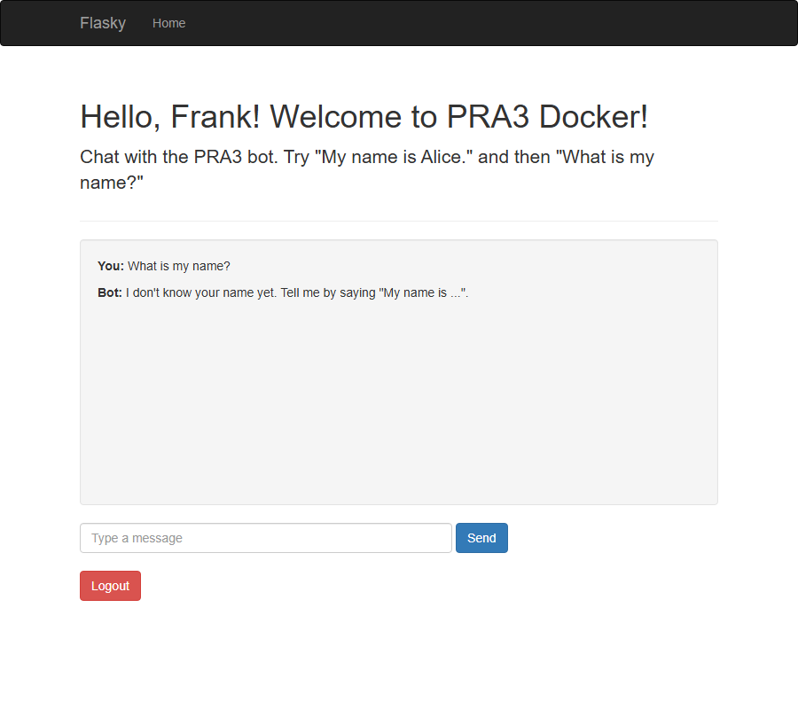

# E444-F2026-PRA3

**Author:** Frank (Qingtao) Liu

This repo is a clone of https://github.com/miguelgrinberg/flasky.
It reproduces and extends the examples from *Flask Web Development* (Miguel Grinberg) for ECE444 PRA3.

## Activity 1.2: Textbook Examples 2-1 and 2-2

Run with the virtual environment activated:

```
flask --app hello run
```

### Example 2-1: minimal application

`http://127.0.0.1:5000/`


### Example 2-2: dynamic route

`http://127.0.0.1:5000/user/Frank`


## Activity 1.3: Templates, Bootstrap and Flask-Moment (Chapter 3)

The home page extends a shared `base.html` built on Flask-Bootstrap. It shows a navigation bar,
a "Hello Frank!" title, and the local time rendered by Flask-Moment in `LLLL` format.

`http://127.0.0.1:5000/`



## Activity 1.4: Web Forms (Chapter 4)

Example 4-7 adds a name form that stores the name in the user session, redirects after POST,
and flashes a message when the name changes. On top of that, the form now asks for a UofT email:

- A valid email containing `utoronto` shows the name and the email address.
- Any other valid email shows "Please use your UofT email."
- A value without `@` is blocked by the browser, because the field is an HTML5 `type="email"` input.
- Changing the name or the email flashes a warning above the title.

Test sequence: submit `Frank` with a UofT email, then `Frank Liu` with `Frank` (blocked by the browser),
then `Frank Liu` with a non-UofT email. Result of the last submission:



## Activity 2: Docker

The app is containerized with the `Dockerfile` in the repository root. Dependencies are pinned in
`requirements.txt`, and `.dockerignore` keeps the local `venv/`, `.git/` and screenshots out of the image.

Build the image and run a container:

```
docker build -t python-docker .
docker run -d -p 5000:5000 --name pra3-flask python-docker
docker ps -a
```

The application is then available at http://localhost:5000. Stop and remove the container with:

```
docker stop pra3-flask
docker rm pra3-flask
```

## Activity 2.5: Chatbot with Memory

After a name and a valid UofT email are submitted, the app redirects to `/chatbot`. The page sends each
message as JSON to the `/chat` endpoint with `fetch()` and shows the bot's reply in the chat area.

- "My name is Alice." stores `Alice` in `session["chat_name"]` and replies "Nice to meet you, Alice!".
- "What is my name?" reads `session["chat_name"]` in a later request and replies "Your name is Alice.".
- The Logout button posts to `/logout`, which calls `session.clear()` and returns to the Home page.
  The application keeps running; only this browser's remembered data is removed.

**Where is the information stored?** In Flask's default session, which is a cookie named `session`
kept in the user's browser. Its content is base64-encoded JSON plus a signature made with `SECRET_KEY`.
Anyone can read the content, but Flask rejects the cookie if it has been modified.

**How does Flask know two requests come from the same user?** The browser sends the `session` cookie
back with every request to the same site, including the `fetch()` calls to `/chat`. Flask verifies the
signature, loads the data into `session`, and sends an updated cookie when the data changes.

Memory before logging out:



After logging out and returning through the name and email form, the name is forgotten:


